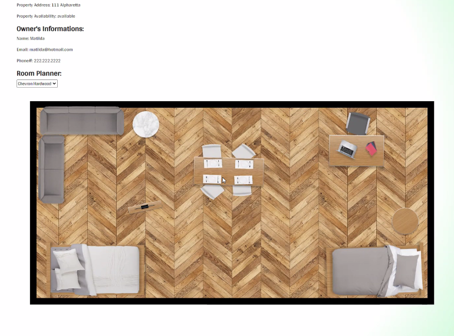

# LEaseGIT
 

## Description:
Property owners are always looking for an easy and fast way to list their property whether on sale or for rent. We want to give owners a way to get in touch with tenants, and tenants a way that they can easily find their new home. Finally, we want to give both owners and tenants a way that they can design different layouts using their furniture to optimize their space within the property and make it feel like home, even before moving in.

## User Story:
* As an owner I want to list my property and attract potential tenants by providing an animated floor plan.

* As a tenant I want to search for a  list of properties available for rent  and design a home with furniture based on the layout of the property.

## Technologies Used:
					
* MySQL and Sequelize ORM for database.
* Node. Js and Express. Js to create API
* Handlebars. Js as the template engine.
* Included authentication(express-session and cookies)
* CSS handler framework: Bootstrap
* Matter. js for room layout tool
* Dotenv (for environmental variables)
* Bcrypt to hash password
* Heroku to deploy site
			

## Screenshots:
---

Screenshot of login page-

Screenshot of listing page-

Screenshot of Add Property site-

Screenshot of Room Planer scroll options-

## URLs:
-----
[Link to GitHub Repository](https://github.com/scottydphillips/LEaseGIT)

[link to Deployed Herokuh Site](Herokuhttps://still-tundra-21201.herokuapp.com/login)